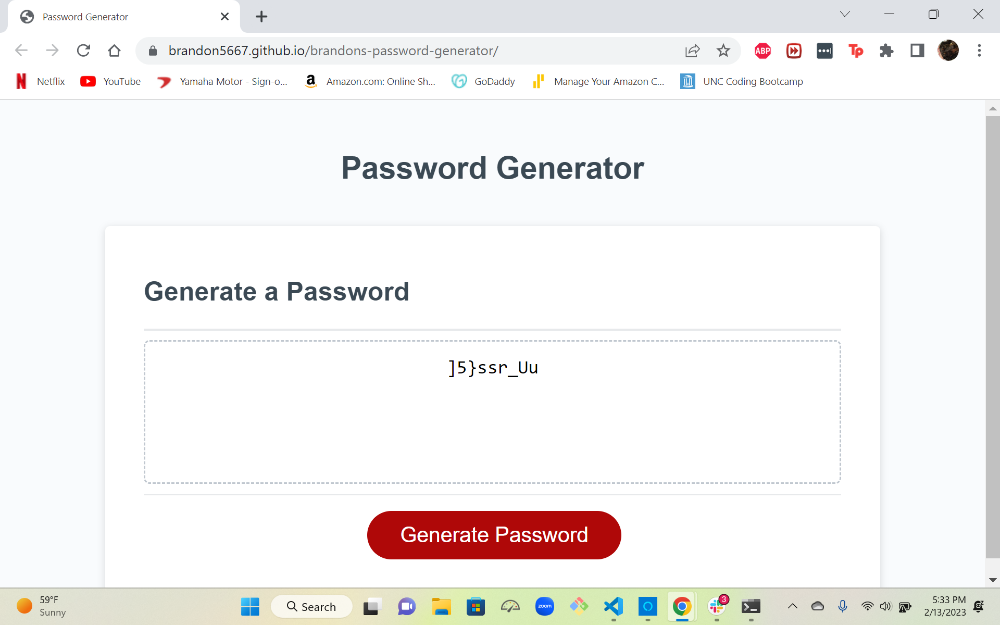

# Brandon's password generator

This is a password generator developed for the UNC Coding Bootcamp

## Usage

Click the Generate Password Button to start process.
Select your character length from 8 to 128 characters.
Click ok if you want to included lowercase characters other wise select cancel.
Click ok if you want to included uppercase characters other wise select cancel.
Click ok if you want to included numbers other wise select cancel.
Click ok if you want to included special characters other wise select cancel.

## Contributing

Pull requests are welcome. For major changes, please open an issue first
to discuss what you would like to change.

Please make sure to update tests as appropriate.

## Deployed Application

https://brandon5667.github.io/brandons-password-generator/

## Screenshot

